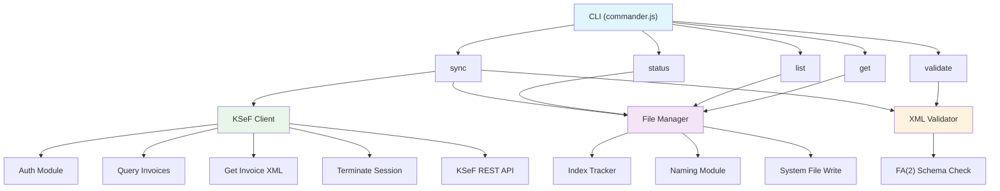

# 🛠️ KSeF Sync - Instrukcja techniczna

Dokumentacja dla developerów i administratorów IT.

## Spis treści
1. [Architektura](#architektura)
2. [Moduły](#moduły)
3. [Dodawanie nowych komend](#dodawanie-nowych-komend)
4. [Struktura projektu](#struktura-projektu)
5. [Uruchamianie testów](#uruchamianie-testów)
6. [CI/CD](#cicd)
7. [Znane ograniczenia](#znane-ograniczenia)

---

## Architektura



### Komponenty

**CLI Layer** (src/cli/)
- Parsowanie argumentów: `commander.js`
- Formatowanie: kolory, emojis, tabele
- Progress tracking: spinners, progress bary
- Graceful shutdown: SIGINT/SIGTERM

**KSeF Client** (src/ksef/)
- Autentykacja z tokenem
- Retry logic (3 próby, exponential backoff)
- Session management (auto-refresh)
- REST API calls z Axios

**File Manager** (src/storage/)
- Zapis XML na dysk (atomowe operacje)
- Naming convention: YYYY-MM-DD_NIP_KSEFREF.xml
- Folder hierarchy: YYYY-MM/{type}/
- Index tracking: .index.json (duplikaty)

**XML Validator** (src/validator/)
- Walidacja struktury XML
- Sprawdzenie FA(2) schema
- Reporting błędów z numerami linii

---

## Moduły

### 1. KSeF Client (`src/ksef/client.ts`)

```typescript
// Autentykacja
const auth = createAuth(ksefClient);
const session = await auth.authenticate(nip, token);

// Query faktur
const result = await ksefClient.queryInvoices({
  pageSize: 100,
  queryCriteria: {
    subjectType: 'subject_type.buyer',
    dateFrom: '2024-01-01',
    dateTo: '2024-01-31'
  }
});

// Pobranie XML
const invoice = await ksefClient.getInvoice(ksefNumber);

// Zakończenie sesji
await ksefClient.terminateSession();
```

**Features:**
- Session token refresh automatycznie
- Retry logic: 3 próby, backoff 1s → 3s → 9s
- Error hierarchy: KsefError → KsefAuthError, KsefApiError, etc.
- Request logging na `debug` level

### 2. File Manager (`src/storage/file-manager.ts`)

```typescript
const manager = new InvoiceFileManager({ 
  outputDir: './output/faktury' 
});
await manager.initialize();

// Zapis jednej faktury
const result = await manager.saveInvoice({
  xml: '<Faktura>...</Faktura>',
  header: {
    ksefReferenceNumber: 'ref-123',
    invoicingDate: '2024-01-15',
    subjectType: 'zakup',
    nip: '5213000001'
  }
});

// Zapis batch
const batch = await manager.saveBatch(invoices);

// Listowanie
const items = await manager.listSaved({
  dateFrom: '2024-01-01',
  dateTo: '2024-01-31'
});

// Statystyki
const stats = manager.getStats();
```

**Features:**
- Atomic writes: `.tmp` → rename
- Duplicate detection via `.index.json`
- UTF-8 encoding
- Folder structure: YYYY-MM/{zakup|sprzedaz}/

### 3. XML Validator (`src/validator/xml-validator.ts`)

```typescript
const validator = new InvoiceXMLValidator();

// Waliduj plik
const result = await validator.validate('./file.xml');
// { valid: boolean, errors: ValidationError[] }

// Waliduj folder
const batch = await validator.validateDir('./output/faktury');
// { total, valid, invalid, results[] }
```

**Sprawdzenia:**
- Struktura XML (balanced tags)
- Namespace deklaracje
- FA(2) elementy obowiązkowe
- NIP format (10 cyfr)
- Daty w formacie YYYY-MM-DD
- Kwoty numeryczne

### 4. Logger (`src/logger.ts`)

```typescript
logger.debug('Debug message');
logger.info('Info message');
logger.warn('Warning message');
logger.error('Error message', error);
```

Kontrola via `LOG_LEVEL` env var.

---

## Dodawanie nowych komend

### Struktura komendy

```typescript
// src/cli/commands/my-command.ts
import { Command } from 'commander';

export function createMyCommand(): Command {
  const command = new Command('my-command');
  command
    .description('Opis komendy')
    .option('--option <value>', 'Opis opcji')
    .action((options) => myAction(options)
      .catch(handleError));
  
  return command;
}

async function myAction(options: any): Promise<void> {
  // Logika komendy
}

function handleError(error: Error): void {
  console.error(`${emojis.error} Error:`, error.message);
  process.exit(1);
}
```

### Rejestracja w CLI

```typescript
// src/cli/index.ts
import { createMyCommand } from './commands/my-command.js';

export function setupCli(program: Command): void {
  // ... pozostałe komendy ...
  program.addCommand(createMyCommand());
}
```

### Dostęp do FileManager w komendzie

```typescript
const fileManager = new InvoiceFileManager({ 
  outputDir: config.insert.outputDir 
});
await fileManager.initialize();

// Użyj fileManager...
```

---

## Struktura projektu

```
ksef-sync/
├── src/
│   ├── index.ts                    # Entry point CLI
│   ├── config.ts                   # Config validation (zod)
│   ├── errors.ts                   # Custom error classes
│   ├── logger.ts                   # Logging (pino)
│   ├── cli/                        # CLI layer
│   │   ├── index.ts               # Setup + graceful shutdown
│   │   ├── formatter.ts           # Colors, emojis, tables
│   │   ├── progress.ts            # Spinners, progress bars
│   │   └── commands/
│   │       ├── sync.ts
│   │       ├── status.ts
│   │       ├── list.ts
│   │       ├── get.ts
│   │       └── validate.ts
│   ├── ksef/                       # KSeF API client
│   │   ├── client.ts              # Main client
│   │   ├── auth.ts                # Authentication
│   │   ├── types.ts               # TypeScript interfaces
│   │   └── xml-parser.ts          # XML parsing
│   ├── storage/                    # File storage
│   │   ├── file-manager.ts        # Main API
│   │   ├── index-tracker.ts       # Duplicate tracking
│   │   ├── naming.ts              # File naming
│   │   ├── types.ts               # TypeScript interfaces
│   │   └── index.ts               # Exports
│   └── validator/                  # XML validation
│       └── xml-validator.ts       # Validator class
├── tests/
│   ├── ksef/
│   │   └── client.test.ts
│   ├── storage/
│   │   └── file-manager.test.ts
│   ├── validator/
│   │   └── xml-validator.test.ts
│   └── e2e/
│       └── cli.test.ts
├── docs/
│   ├── instrukcja-uzytkownika.md
│   ├── instrukcja-techniczna.md (ten plik)
│   ├── ksef-api.md
│   └── changelog.md
├── .env.example
├── package.json
├── tsconfig.json
├── eslint.config.js
├── vitest.config.ts
└── README.md
```

---

## Uruchamianie testów

### Wszystkie testy
```bash
npm test
```

### Testy w trybie watch
```bash
npm test -- --watch
```

### Testy jednego pliku
```bash
npm test -- tests/validator/xml-validator.test.ts
```

### Coverage
```bash
npm run test:coverage
```

### E2E testy
```bash
npm test -- tests/e2e/
```

### Testy z UI
```bash
npm run test:ui
```

---

## Struktura testu

```typescript
import { describe, it, expect, beforeAll, afterAll } from 'vitest';

describe('My Module', () => {
  beforeAll(() => {
    // Setup
  });

  afterAll(() => {
    // Cleanup
  });

  it('should do something', async () => {
    // Arrange
    const input = 'test';
    
    // Act
    const result = await myFunction(input);
    
    // Assert
    expect(result).toBe('expected');
  });
});
```

### Mocking w testach

```typescript
import { vi } from 'vitest';

// Mockuj moduł
vi.mock('../src/ksef/client.ts', () => ({
  ksefClient: {
    queryInvoices: vi.fn().mockResolvedValue({
      invoiceHeaderList: []
    })
  }
}));

// Spy na funkcję
const spy = vi.spyOn(ksefClient, 'getInvoice');
expect(spy).toHaveBeenCalledWith('ref-123');
```

---

## CI/CD

### GitHub Actions

```yaml
# .github/workflows/test.yml
name: Tests

on: [push, pull_request]

jobs:
  test:
    runs-on: ubuntu-latest
    strategy:
      matrix:
        node-version: [18.x, 20.x]
    
    steps:
      - uses: actions/checkout@v3
      - uses: actions/setup-node@v3
        with:
          node-version: ${{ matrix.node-version }}
      - run: npm install
      - run: npm run type-check
      - run: npm run lint
      - run: npm test -- --run
```

### Local pre-commit hook

```bash
#!/bin/bash
# .git/hooks/pre-commit
npm run type-check && npm run lint && npm test -- --run
```

---

## Znane ograniczenia

### 1. XSD Validation
Aktualnie walidujemy tylko podstawowe struktury FA(2). Pełna walidacja XSD wymaga `libxmljs2` z bindingami C++, które mogą mieć problemy na Windows.

**Rozwiązanie**: Użyj `npm run validate` do sprawdzenia podstawowych błędów.

### 2. Session Timeout
Token KSeF wygasa po 30 minutach. Program automatycznie odświeża, ale:
- Synchronizacja >30 minut może mieć problemy
- Rozwiązanie: Podziel na mniejsze zakresy dat

### 3. Rate Limiting
KSeF API ma limit ~100 zapytań/minutę.

**Rozwiązanie**: Program automatycznie czeka między zapytaniami.

### 4. Encoding
Pliki obsługują tylko UTF-8 i Windows-1250 (CSV).

**Rozwiązanie**: Konwersja znaków specjalnych w Import Insert.

### 5. Folder Depth
Windows limituje długość ścieżki do 260 znaków. Nasze pliki zwykle są ~150 znaków.

**Rozwiązanie**: Używaj krótszych `OUTPUT_DIR`.

---

## Developerskie polecenia

```bash
# Development
npm run dev              # Watch mode

# Building
npm run build            # Compile TypeScript

# Linting
npm run lint             # ESLint check
npm run lint:fix         # Fix linting issues

# Formatting
npm run format           # Prettier format

# Testing
npm test                 # Run all tests
npm run test:ui          # Tests with UI
npm run test:coverage    # Coverage report

# Quality
npm run type-check       # TypeScript check

# CLI
npm start -- --help      # Show CLI help
npm start -- sync --help # Show sync command help
```

---

## Deployment

### Build na produkcję
```bash
npm run build
# Wynik: dist/ folder

# Zapakowuj projektem:
tar -czf ksef-sync.tar.gz dist/ node_modules/
```

### Uruchomienie z globalnym npm
```bash
npm link
# Teraz możesz: ksef-sync sync --help
```

---

## Debugging

### Enable debug logging
```bash
LOG_LEVEL=debug npm start -- sync --from 2024-01-01 --to 2024-01-31
```

### VS Code debugger
```json
// .vscode/launch.json
{
  "version": "0.2.0",
  "configurations": [
    {
      "type": "node",
      "request": "launch",
      "name": "KSeF Sync",
      "runtimeExecutable": "npm",
      "runtimeArgs": ["start", "--", "sync", "--from", "2024-01-01", "--to", "2024-01-31"],
      "console": "integratedTerminal"
    }
  ]
}
```

---

**Wersja**: 1.0.0  
**Ostatnia aktualizacja**: Styczeń 2024  
**Autor**: [Twoja nazwa]
